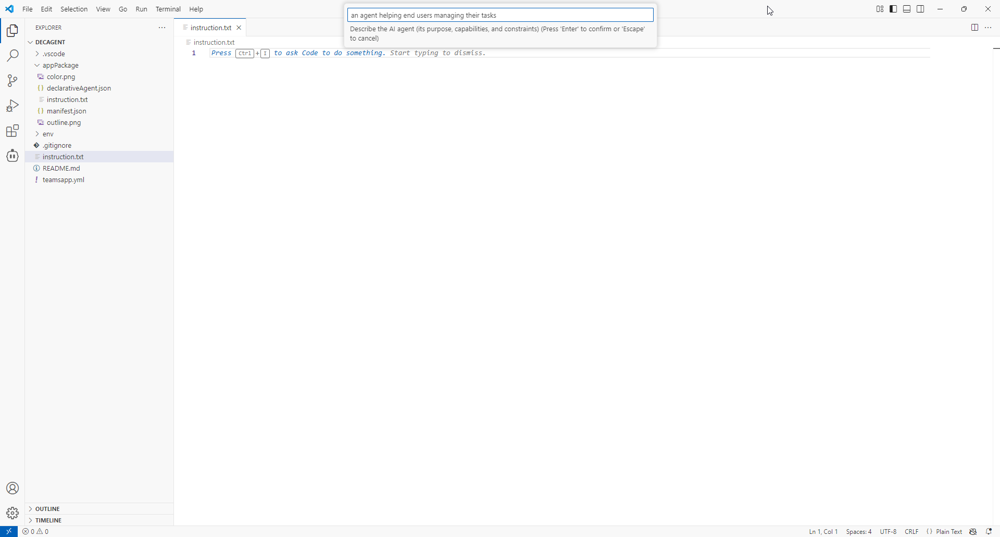
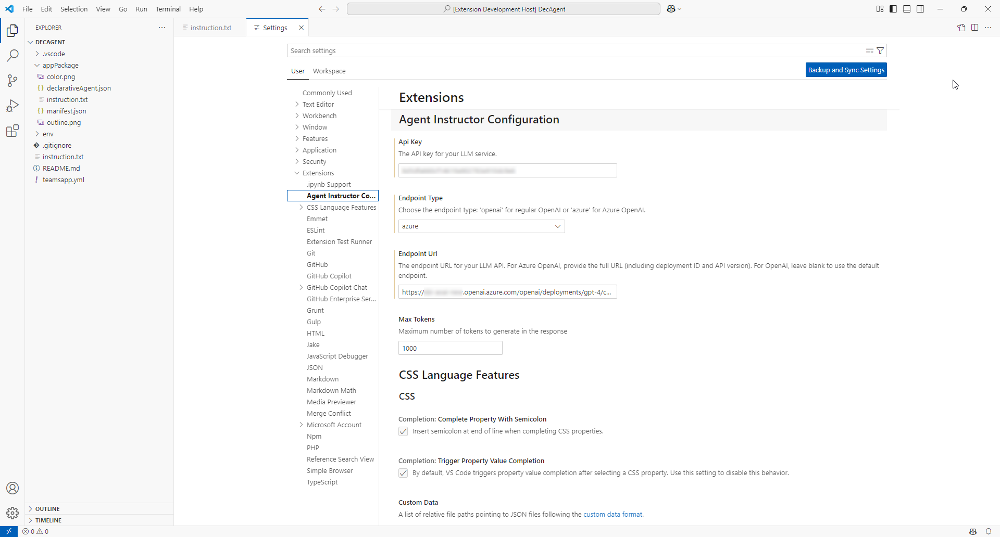

<h1 align="center">
  <a href="(https://github.com/stephanbisser/agent-instructor">
    
  </a>
  <br>Agent Instructor<br>
</h1>

# Agent Instructor for VS Code

A powerful VS Code extension designed to help developers create, analyze, and refine instructions for declarative AI agents.

## Features

### 1. Analyze Instructions
Evaluates existing agent instructions for clarity and potential improvements:
- Generates a clarity score (0-100)
- Identifies ambiguous phrases
- Provides specific improvement suggestions
- Offers one-click corrections
- Visualizes analysis results with charts


### 2. Generate Instructions
Creates comprehensive instructions for new agents:
- Interactive agent description input
- AI-powered instruction generation
- Automatic formatting and organization
- Maintains existing content when adding new instructions
- Supports multiple instruction sets per file




## Installation

1. Open VS Code
2. Go to Extensions (Ctrl+Shift+X)
3. Search for "Agent Instructor"
4. Click Install

## Configuration

Configure the extension in VS Code settings (File > Preferences > Settings > Extensions > Agent Instructor):

| Setting | Description | Default |
|---------|-------------|---------|
| `apiKey` | Your LLM service API key | "" |
| `endpointType` | Choose `openai` or `azure` | "openai" |
| `endpointUrl` | LLM API endpoint URL | "" |
| `maxTokens` | Maximum tokens in response (1-4096) | 1000 |



### Endpoint Configuration Examples

#### OpenAI
```json
{
    "agentInstructor.endpointType": "openai",
    "agentInstructor.endpointUrl": "",
    "agentInstructor.apiKey": "your-openai-api-key"
}
```

#### Azure OpenAI
```json
{
    "agentInstructor.endpointType": "azure",
    "agentInstructor.endpointUrl": "https://your-resource.openai.azure.com/deployments/your-deployment/chat/completions?api-version=2023-07-01-preview",
    "agentInstructor.apiKey": "your-azure-api-key"
}
```

## Usage

### Analyzing Instructions

1. Open your `instruction.txt` file
2. Command Palette (Ctrl+Shift+P)
3. Select "Agent Instructor: Analyze Instructions"
4. Review the analysis in the sidebar:
   - Clarity Score
   - Identified Issues
   - Suggested Improvements
5. Click "Apply Correction" to implement suggestions

### Generating Instructions

1. Create or open an `instruction.txt` file
2. Command Palette (Ctrl+Shift+P)
3. Select "Agent Instructor: Generate Instructions"
4. Enter your agent description
5. Review and edit generated instructions

## Best Practices

- Keep instruction files named as `instruction.txt`
- Use clear, specific agent descriptions
- Review and customize generated instructions
- Regularly analyze existing instructions
- Apply suggested improvements selectively

## Troubleshooting

Common issues and solutions:

1. **API Connection Failed**
   - Verify API key is correct
   - Check endpoint URL format
   - Ensure internet connectivity

2. **Invalid File Type**
   - Ensure file is named `instruction.txt`
   - Open file in editor before running commands

3. **Generation/Analysis Timeout**
   - Try reducing `maxTokens` setting
   - Check internet connection stability

## Development

### Building from Source

```bash
git clone https://github.com/stephanbisser/agent-instructor.git
cd agent-instructor
npm install
npm run compile
```

### Running Tests

```bash
npm run test
```

## Release Notes

### 0.0.6
- Added maxTokens configuration
- Improved error handling
- Enhanced UI responsiveness

### 0.0.1
- Initial preview release
- Basic analysis features
- Instruction generation support

## Contributing

1. Fork the repository
2. Create a feature branch
3. Submit a pull request

## License

This project is licensed under the MIT License.

## Support

For issues and feature requests, please use the [GitHub Issues](https://github.com/stephanbisser/agent-instructor/issues) page.